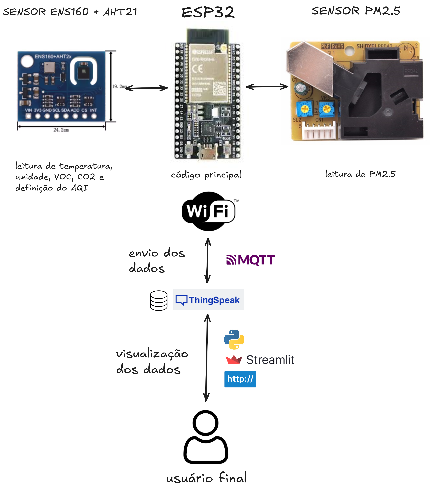

# 🏡 Monitoramento da Qualidade do Ar Interno - ESP32

[](https://www.python.org/downloads/)
[](https://streamlit.io/)

Este projeto, parte da discplina Projeto em Engenharia da Computação 2025/1 da UNIFESP-ICT/SJC oferece uma interface intuitiva e em tempo real para monitorar a **qualidade do ar interno** utilizando dados coletados por um dispositivo ESP32. A aplicação web, desenvolvida com Streamlit, exibe leituras de diversos sensores, fornece referências teóricas sobre os parâmetros monitorados e permite receber alertas via e-mail.

---

## ✨ Funcionalidades

* **Leitura de Sensores em Tempo Real**: Visualize a última leitura e a média da última hora para parâmetros como **Temperatura**, **Umidade**, **VOC** (Compostos Orgânicos Voláteis), **eCO₂** (Dióxido de Carbono Equivalente), **PM2.5** (Material Particulado 2.5) e **AQI** (Índice de Qualidade do Ar).
* **Série Histórica**: Acompanhe a evolução dos dados de cada sensor ao longo do tempo através de gráficos interativos.
* **Referência Teórica**: Acesse informações detalhadas sobre os sensores utilizados (AQI, CO2, PM2.5, Temperatura e Umidade) e tabelas de classificação para os níveis de AQI e eCO₂/CO₂ a partir do datasheet.
* **Alertas Personalizados**: Cadastre seu e-mail para receber notificações quando os níveis dos sensores ultrapassarem os limites recomendados.
* **Suporte**: Obtenha informações de contato para suporte e acesso direto ao repositório do projeto.

---

## 🚀 Como Executar

Acesse o projeto através do link [] ou siga os passos abaixo para colocar o projeto em funcionamento na sua máquina local:

### Pré-requisitos

Certifique-se de ter o **Python 3.9** ou superior instalado. Você pode baixá-lo em [python.org](https://www.python.org/downloads/).

### 1. Clonar o Repositório

Primeiro, clone este repositório para o seu ambiente local:

```bash
git clone https://github.com/gbeloso/esp32-environment.git
cd esp32-environment
```

### 2. Configurar Variáveis de Ambiente
Crie um arquivo .env na raiz do projeto e adicione a chave da sua API de leitura de dados do Thingspeak.

```bash
API_URL="SUA__API_AQUI"
```

Substitua "SUA_API_AQUI" pela API KEY real.

### 3. Instalar dependências

Instale as bibliotecas Python necessárias usando pip a partir do arquivo requirements.txt
```bash
pip install -r requirements.txt
```

### 4. Executar a Aplicação Streamlit
Após instalar as dependências, execute a aplicação Streamlit a partir do diretório raiz do projeto:

```bash
streamlit run app.py
```

### 🛠 Principais Tecnologias Utilizadas


- ESP32: microcontrolador com o código principal
- Sensor ENS160 + AHT21: temperatura, umidade, VOC, CO2 e AQI
- Sensor PM2.5 (PPD42NS): partículas PM2.5
- MQTT: protocolo de envio dos dados
- Thingspeak: para receber e armazenar os dados
- Streamlit: Framework Python para criação de aplicações web interativas.
- Requests: Biblioteca Python para fazer requisições HTTP a APIs.
- Pandas: Biblioteca para manipulação e análise de dados.
- re: Módulo para operações com expressões regulares.
- datetime: Módulo para manipulação de datas e horas.
- streamlit-autorefresh: Componente Streamlit para recarregar a página automaticamente.
- python-dotenv: Para carregar variáveis de ambiente de um arquivo .env.